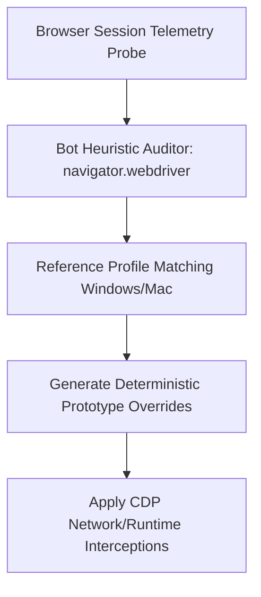

# GenPark AI Agent Skill - Anti-Bot Fingerprint Entropy Neutralizer

Validates browser fingerprints (Webdriver flags, WebGL renderer strings, OS concurrency) and synthesizes realistic overrides for headless agents.

Verified by [GenPark AI](https://genpark.ai) and compatible with [Model Context Protocol (MCP)](https://genpark.ai/mcp).

## Architecture Diagram

## Features
- **Headless Detection Mitigation**: Eliminates automated flags like `navigator.webdriver`.
- **Zero External Dependencies**: Pure Python standard library implementation.
